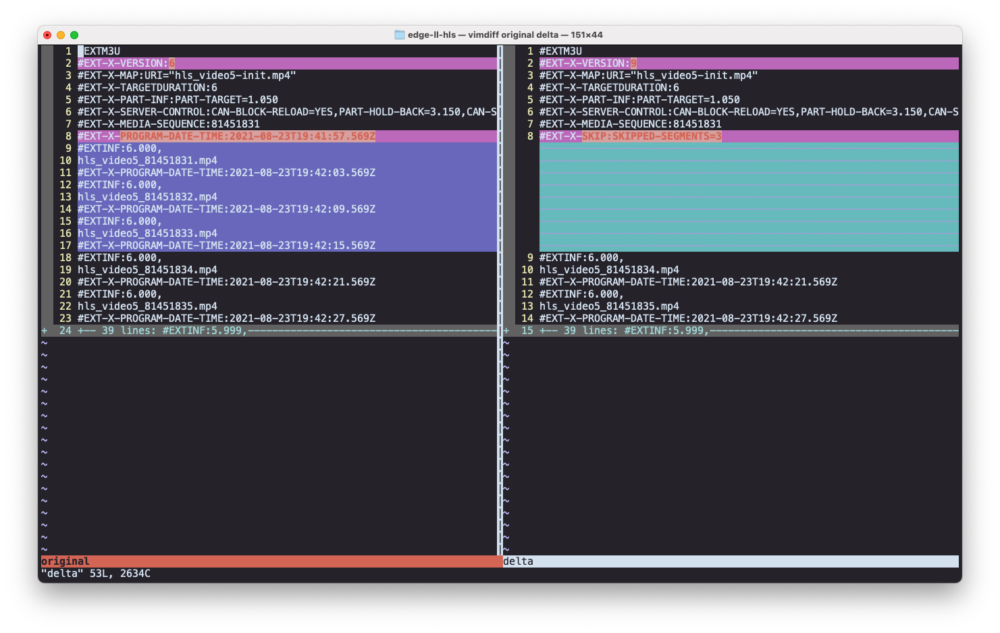

# compute-ll-hls

Source code for a Fastly Compute app that serves LL-HLS (Low Latency HLS) Playlists.

## Overview

---

### Background

Low Latency HLS is a video streaming protocol written by Apple.
- [Apple Documentation](https://developer.apple.com/documentation/http_live_streaming/enabling_low-latency_hls)
- [Latest Spec](https://tools.ietf.org/html/draft-pantos-hls-rfc8216bis-08)

### Motivation

While LL-HLS achieves better end to end latency, which is great for live streams, it results in more requests per second. This is mainly due to video segments being smaller (sub-second as opposed to second duration), resulting in more frequent requests for both video and audio segments as well as the playlists themselves.

This Compute app aims to absorb some of this increased load by handling most of those requests at the edge. It does this via request collapsing, which happens since it uses Fastly's caching infrastructure, and by responding to Delta playlist requests at the edge.

The intended setup is to have a customer origin provide an LL-HLS stream, and point players at this app.

### Delta playlists

Clients can request just what's changed ("delta updates") rather than the entire playlist. This is particularly helpful for longer live streams.

In the LL-HLS spec, this means collapsing the parts of a playlist that are to be skipped into a single line beginning with `#EXT-X-SKIP` . This app applies the playlist manipulation, using a hopefully cached version of the original playlist.

## Building

----

The app is built using the [Fastly CLI](https://github.com/fastly/cli)

`fastly compute build` will generate a WASM binary at `bin/main.wasm`.

A demo app exists here: https://suddenly-ruling-quetzal.edgecompute.app/

## Testing

----
Run unit tests with `cargo test`.

You can run the app locally using the following:

`fastly compute serve`

The backends are defined in `fastly.toml`. Note that the backends
tend to break or stall in the test environment.

## Deploying

----

You can deploy the app to your own compute service by running `fastly compute init`
in this repo and selecting the option to "bring your own" WASM binary when prompted.

You will need to setup at least one origin on the service named "video_backend".
If you wish to use the simple homepage included in this repo, you will also need
to override `BACKEND_PLAYLIST_PATH` (and `BACKEND_ALT_PLAYLIST_PATH`).
